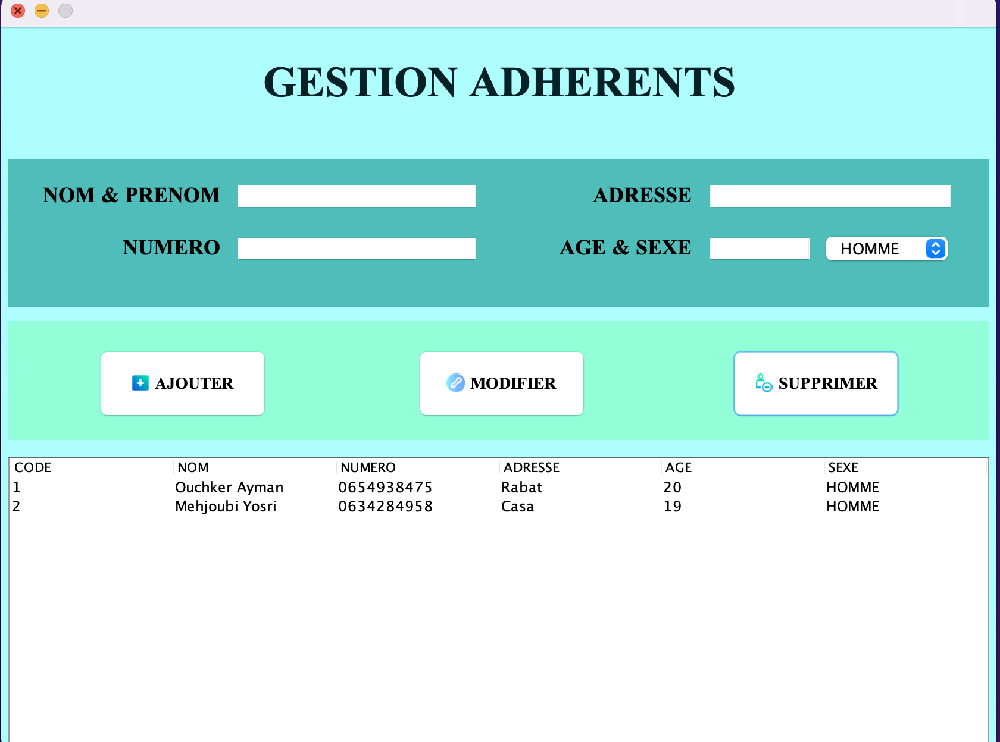

# Gestion De Salle De Sport

C'est un projet de gestion de salle de sport en langage Java.
La classe MenuPrinciApp est la classe principale ( Menu de la salle ) qui contient tous les autres fonctionnalités.

## IDE

Le project est entierement coder par IntelliJ IDEA

## Architecture de projet

Le modele MVC

## JAVA Librairie

sqlite-jdbc-3.36.0.3.jar

## Base de donnée

SQLiteStudio ( SQLite Version 3 ).

## Demo

